# my end-to-end dev flowchart (the execution flow)

this is the EXECUTION FLOW - the sequence of how the brain runs a task. it is SEPARATE from the
knowledge GRAPH (brain/graph/graph.json), which is the context fetcher ("which principles apply").
the flow answers "what step is next"; the graph answers "which cards apply". they never conflate, and
the flow uses STATES + TRANSITIONS while the graph uses nodes + edges, so the vocabulary never
overlaps (P30).

the source of truth is `brain/flow/flow.toml` (authored DATA, like the cards are the graph's data).
`bin/brain-flow.py` reads + validates it and builds `brain/flow/flow.json`; `bin/brain-walk.py` steps
flow.json deterministically. this whole file is GENERATED from flow.json by `brain-flow.py` - do NOT
hand-edit it; re-run the builder after editing flow.toml so it can never drift. it is
drift-gated: `brain-flow.py --check` fails if this file is stale. a state may
CALL the graph (its `recall: true` flag fires brain-recall); the graph never calls the flow - one
direction.

## 1. the machine (generated)

```mermaid
stateDiagram-v2
    [*] --> IDEATION
    [*] --> DOCTRINE
    [*] --> REVIEW
    [*] --> SR_SCAN

    state "IDEATION [entry] raw request received (brain-plan entry)" as IDEATION
    state "INTENT [work] position -> interest; surface ambiguity" as INTENT
    state "ASK [gate] ask the smallest unblocking question; never guess (pre-sanction clarify)" as ASK
    state "RECON [work] read fs; seed the relevant-file set from the task" as RECON
    state "EXPAND [work] grep deps/peripherals; ADD newly-implicated files. the set is mutable" as EXPAND
    state "WOULDIWRITE [work] per file in the set: would i (arpad) write it like this? mark the no's" as WOULDIWRITE
    state "SCRUTINIZE [work] line-by-line on marked files: idiom, magic values, trim the fat" as SCRUTINIZE
    state "SEMANTIC [work] does each fn/struct/class LIVE where it belongs? DRY, reuse, library-fy (P05/P31)" as SEMANTIC
    state "RELOCATE [work] move fns/structs/classes to their correct module/file" as RELOCATE
    state "HIERARCHY [gate] judge the tree: flat->tree if a file too long / folder too flat-crowded; tree->flat if a refactor shrank it" as HIERARCHY
    state "REORG [work] apply the reshape in the flagged direction; this MUTATES the set -> re-expand" as REORG
    state "PLAN [work] small+verbose plan with a worked example, to plans/" as PLAN
    state "PLANPROBE [work] trace the plan THROUGH its own worked example; mark every step the plan cannot actually produce (plan-vs-impl gap)" as PLANPROBE
    state "PLANGATE [gate] architectural scrutiny (brain-meta-style:plan AND the project-native reviewer when one exists - code-truth lens) + worked-example coherence; emits threshold_met only when plan_open==0 AND the worked example traces end-to-end. loops via below_threshold until then" as PLANGATE
    state "SANCTION [boundary] arpad approves; the regime flips to execute-through. LOG the plan's decided-against forks to the trace HERE (not deferred to CURATE - a sanctioned-but-unexecuted plan never reaches it)" as SANCTION
    state "DOCTRINE [gate] resolve the artifact PURPOSE (P41: scratch skip / tutorial light / production exhaustive) and the language row (P06); load the always-load doctrine set plus that language's extras; author the worker prompt carrying P40's before/after exemplars and the find-exhaustively ask. an adjective is not a resolved doctrine - emit unresolved (brain-execute entry, post-sanction)" as DOCTRINE
    state "IMPL [work] dispatch the worker with the prompt DOCTRINE authored; implement the phase (post-sanction)" as IMPL
    state "PHASEGATE [gate] cold unguided multi-lens review vs the repo; converge; emits threshold_met only when nits_open==0 AND consistent-with-repo. loops via below_threshold -> REMEDIATE" as PHASEGATE
    state "ADJUDICATE [work] a finding is EVIDENCE, not a verdict. classify each against the artifact's stated contract: valid | invalid | deferred-to-a-later-phase. ONLY valid findings reach REMEDIATE. an invalid one is REJECTED with a logged reason (brain-trace.py --reject), never fixed - fixing 'this is incomplete' on a deliberately-incomplete artifact is a loop that cannot terminate" as ADJUDICATE
    state "REMEDIATE [work] fix the ADJUDICATED-VALID nits IN PLACE (incl local relocations); does NOT leave the impl phase" as REMEDIATE
    state "VERIFY [gate] build/test/bench honestly; emits sound only when the build is green AND the artifact's OWN stated bar is met AND the bench is within threshold. the bar is usually 'tests pass' but is NOT hardcoded to it: an artifact that ships deliberately red (a rustlings-style tutorial, a lab with todo!()) declares its real bar - e.g. `--features solutions` green while a bare `cargo test` stays red - and THAT is what soundness means for it. measuring against the wrong bar makes unsound permanent, the same non-terminating loop ADJUDICATE breaks at PHASEGATE. loops via unsound -> REMEDIATE. the pass events REQUIRE a returned brain-verifier report: measured, the agent was dispatched on 9 of ~31 visits, so 7 times in 10 the author verified its own work and advanced. verifying yourself is not verification - emit unverified and dispatch the agent" as VERIFY
    state "STYLE [gate] the style gate, and it is ALWAYS required - only an explicit instruction against it skips it. resolve each language in the tree against the style-contract card, dispatch the aav-style lenses (separators, docs, imports, items) to apply it, then PROVE the result with brain-fmt.py --check. emits styled ONLY when the mechanical checks pass: local separators present inside function bodies, no blank line after any separator, global labels inside the closed whitelist, formatter clean. anything else emits unstyled and loops back. before this gate existed STYLE had a single outbound event, which made a hollow pass and a thorough one indistinguishable to the machine - it ran every time and landed nothing" as STYLE_GATE
    state "RECORD [work] categorise by semantics, draft the commit script, stop at the line" as RECORD
    state "CURATE [work] capture every correction/approval/interrupt -> update the store; log the decision trace" as CURATE
    state "BLOCKED [halt] post-sanction ambiguity: stop and ask arpad; resume the blocked state on /continue" as BLOCKED
    state "DONE [terminal] work complete. DISPATCH brain-learner to mine this conversation for durable signal, and SAY SO in the closing line - e.g. `<brief summary>. everything is done. *note* i have dispatched an agent to learn from this conversation and refine the brain`. measured: IMPL was entered 176 times and CURATE 10, so a run that ends without this never taught the brain anything" as DONE
    state "REVIEW [entry] brain-review entry: cold unguided multi-lens review of the current diff; hand findings into the shared gate loop" as REVIEW
    state "SR_SCAN [entry] brain-self-refine entry: run the scripted scan (cards/graph/flow/trace/paths/symlinks/traceability)" as SR_SCAN
    state "SR_FINDINGS [work] read the trace + structural smells; GENERATE the questions from the brain (recall-driven, never a frozen list)" as SR_FINDINGS
    state "SR_ASK [gate] present FINDINGS + QUESTIONS only; he selects + annotates. consent is explicit - an unselected finding is dropped" as SR_ASK
    state "SR_EDIT [work] make ONLY the selected edits, each through the right meta-skill (curate/style/direct)" as SR_EDIT

    ADJUDICATE --> VERIFY: all_invalid
    ADJUDICATE --> VERIFY: deferred
    ADJUDICATE --> REMEDIATE: valid_remain
    ASK --> INTENT: answered
    CURATE --> DONE: learned
    DOCTRINE --> IMPL: resolved
    DOCTRINE --> BLOCKED: unresolved
    EXPAND --> EXPAND: set_grew
    EXPAND --> WOULDIWRITE: set_stable
    HIERARCHY --> REORG: reshape_needed
    HIERARCHY --> PLAN: shape_ok
    IDEATION --> INTENT: received
    IMPL --> BLOCKED: ambiguous
    IMPL --> PHASEGATE: implemented
    IMPL --> DOCTRINE: phase_done
    INTENT --> ASK: ambiguous
    INTENT --> RECON: clear
    PHASEGATE --> ADJUDICATE: below_threshold
    PHASEGATE --> VERIFY: threshold_met
    PLAN --> PLANPROBE: drafted
    PLANGATE --> PLAN: below_threshold
    PLANGATE --> ASK: blocked
    PLANGATE --> SANCTION: threshold_met *boundary*
    PLANPROBE --> PLAN: gap_found
    PLANPROBE --> PLANGATE: traced
    RECON --> EXPAND: seeded
    RECORD --> CURATE: prepared
    RELOCATE --> EXPAND: moved
    REMEDIATE --> PHASEGATE: fixed
    REORG --> EXPAND: reshaped
    REVIEW --> PHASEGATE: reviewed
    SANCTION --> DOCTRINE: sanctioned
    SCRUTINIZE --> SEMANTIC: cleaned
    SEMANTIC --> RELOCATE: misplacements_found
    SEMANTIC --> HIERARCHY: placement_ok
    SR_ASK --> DONE: none_selected
    SR_ASK --> SR_EDIT: selected
    SR_EDIT --> VERIFY: edited
    SR_FINDINGS --> SR_ASK: found
    SR_SCAN --> SR_FINDINGS: scanned
    STYLE_GATE --> RECORD: styled
    STYLE_GATE --> STYLE_GATE: unstyled
    VERIFY --> STYLE_GATE: last_phase
    VERIFY --> DOCTRINE: more_phases [!self_refine]
    VERIFY --> REMEDIATE: unsound
    VERIFY --> VERIFY: unverified
    WOULDIWRITE --> SEMANTIC: all_pass
    WOULDIWRITE --> SCRUTINIZE: some_marked
    BLOCKED --> [*]
    DONE --> [*]
```

## 2. state -> owner (generated from flow.json)

each state is owned by a brain skill or one of the two cold agents. the boundary state (SANCTION)
flips ask-first -> execute-through; BLOCKED is the only post-sanction stop (ask arpad, resume on
/continue).

| state | kind | entry | regime | owner | recall |
|---|---|---|---|---|---|
| IDEATION | entry | true | ask-first | - | false |
| INTENT | work |  |  | brain-meta-intent | true |
| ASK | gate |  |  | brain-meta-intent | true |
| RECON | work |  |  | brain-recall+brain-plan | true |
| EXPAND | work |  |  | brain-recall | true |
| WOULDIWRITE | work |  |  | brain-meta-style:plan | true |
| SCRUTINIZE | work |  |  | brain-meta-style:style | true |
| SEMANTIC | work |  |  | brain-meta-style:plan | true |
| RELOCATE | work |  |  | worker+brain-review-gate | false |
| HIERARCHY | gate |  |  | brain-meta-style:plan | false |
| REORG | work |  |  | worker+brain-review-gate | false |
| PLAN | work |  |  | brain-plan | true |
| PLANPROBE | work |  |  | brain-plan | true |
| PLANGATE | gate |  |  | brain-meta-style:plan | true |
| SANCTION | boundary |  |  | brain-meta-drive | false |
| DOCTRINE | gate | true | execute-through | brain-meta-author-prompt | true |
| IMPL | work |  | execute-through | worker | true |
| PHASEGATE | gate |  |  | brain-review-gate | false |
| ADJUDICATE | work |  |  | brain-meta-style | true |
| REMEDIATE | work |  |  | brain-meta-author-prompt+worker | true |
| VERIFY | gate |  |  | brain-verifier | false |
| STYLE | gate |  |  | brain-meta-style:style + aav-style-separators + aav-style-docs + aav-style-imports + aav-style-items | true |
| RECORD | work |  |  | brain-meta-commit | false |
| CURATE | work |  |  | brain-meta-curate | true |
| BLOCKED | halt |  |  | brain-meta-intent | false |
| DONE | terminal |  |  | brain-learner | false |
| REVIEW | entry | true | ask-first | brain-review-gate | false |
| SR_SCAN | entry | true | ask-first | brain-self-refine | false |
| SR_FINDINGS | work |  |  | brain-self-refine | true |
| SR_ASK | gate |  |  | brain-self-refine | false |
| SR_EDIT | work |  |  | brain-self-refine | true |

## 3. how brain-meta-drive steps it

brain-meta-drive does not invent the sequence - it queries brain-walk:
1. `brain-walk --state <id>` returns the state's owner + recall flag.
2. if recall: run brain-recall to load the relevant cards (the one call into the graph).
3. run the owner; it yields an outcome event (threshold_met / below_threshold / set_grew / ...).
4. `brain-walk --state <id> --on <event>` returns the single next state - from the data, not judgement.

cyclic refinement is REQUIRED, not optional (P03). three regions LOOP until a metric threshold holds,
then advance exactly one phase:
- RECON..REORG: the per-file scrutiny + bidirectional reorg loop (P29, P27). the relevant-file set
  expands to a fixpoint (EXPAND self-loop) and re-expands after every move/reshape.
- PLAN -> PLANPROBE -> PLANGATE: the plan is traced THROUGH its own worked example; a gap routes back
  to PLAN. PLANGATE emits threshold_met (-> SANCTION) only when the plan is open-question-free and the
  example traces end-to-end, else below_threshold loops back to PLAN.
- IMPL -> PHASEGATE -> VERIFY: PHASEGATE loops below_threshold -> REMEDIATE -> PHASEGATE until the
  review converges (nits zero, consistent with the repo); VERIFY loops unsound -> REMEDIATE (which
  re-enters PHASEGATE) until the build/test/bench is sound. only then does it advance.

the gates never advance dirty: a threshold that is not met routes BACK, never forward.
